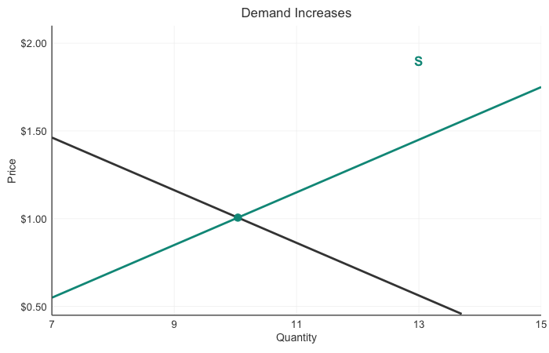

# RevealJS Quarto Editing Guide
**Quick reference for editing Chapter3_SupplyDemand_RevealJS.qmd**

---

## Table of Contents
1. [Creating and Sizing Figures](#1-creating-and-sizing-figures)
2. [Callout Blocks](#2-callout-blocks)
3. [Images](#3-images)
4. [Two-Column Layouts](#4-two-column-layouts)
5. [Embedding GIFs and Interactive Content](#5-embedding-gifs-and-interactive-content)
6. [Embedding Videos](#6-embedding-videos)
7. [Common Formatting](#7-common-formatting)
8. [Troubleshooting](#8-troubleshooting)

---

## 1. Creating and Sizing Figures

### Basic R Figure

```r
## My Slide Title

```{r}
#| fig-width: 7
#| fig-height: 4
#| fig-align: center

ggplot(data, aes(x = x, y = y)) +
  geom_line() +
  theme_modern_econ()
```
```

### Figure Options

| Option | Purpose | Typical Values |
|--------|---------|----------------|
| `fig-width` | Width in inches | 7 (single), 10-11 (side-by-side) |
| `fig-height` | Height in inches | 4 (standard for 16:9) |
| `fig-align` | Alignment | `center`, `left`, `right` |
| `out-width` | CSS width | `"80%"`, `"100%"` |

### Common Figure Sizes

```r
# Single centered plot (standard)
#| fig-width: 7
#| fig-height: 4
#| fig-align: center

# Side-by-side plots (using gridExtra)
#| fig-width: 10
#| fig-height: 4
#| fig-align: center

# Small figure
#| fig-width: 5
#| fig-height: 3
#| fig-align: center
```

### Positioning with Output Width

```r
# Make figure take 70% of slide width
#| fig-width: 7
#| fig-height: 4
#| out-width: "70%"
#| fig-align: center
```

---

## 2. Callout Blocks

### Basic Block (Teal bordered box)

```markdown
::: {.block}
**Important Point**

This text appears in a highlighted teal box with good contrast.
:::
```

**Result:** Light teal background with dark green text, teal left border

### Block with Bold Header

```markdown
::: {.block}
**Result:** Price ↑ and Quantity ↑ **(Both certain)**
:::
```

**IMPORTANT:** Do NOT use `###` or `####` headings inside blocks - this breaks RevealJS navigation. Use `**bold text**` instead.

### Block Quote

```markdown
> This is a blockquote
>
> It has a teal left border and light background
```

---

## 3. Images

### Storage Location

Store images in: `images/` subdirectory

```bash
Chapter_03_Supply_Demand/
├── Chapter3_SupplyDemand_RevealJS.qmd
├── images/
│   ├── eclipse_hotel.jpg
│   ├── demand_increase.gif
│   └── my_new_image.png
```

### Adding an Image

```markdown

```

### Image with Size Control

```markdown
{width="60%"}
```

### Image with Caption

```markdown
{width="70%"}
```

### Centered Image in Container

```markdown
::: {.center}
{width="50%"}
:::
```

### Image with Custom Styling

```markdown

```

### Common Image Widths

- `width="40%"` - Small, good for side-by-side
- `width="60%"` - Medium
- `width="80%"` - Large but not full width
- `width="100%"` - Full slide width

---

## 4. Two-Column Layouts

### Basic Two Columns (Equal Width)

```markdown
## Slide Title

::: {.columns}
:::: {.column width="50%"}
**Left Column**

- Item 1
- Item 2
::::

:::: {.column width="50%"}
**Right Column**

- Item A
- Item B
::::
:::
```

### Unequal Columns (60/40 split)

```markdown
::: {.columns}
:::: {.column width="60%"}
**Main content here**

Longer text or larger figure
::::

:::: {.column width="40%"}
**Supporting content**

{width="100%"}
::::
:::
```

### Three Columns

```markdown
::: {.columns}
:::: {.column width="33%"}
Column 1
::::

:::: {.column width="33%"}
Column 2
::::

:::: {.column width="33%"}
Column 3
::::
:::
```

### Column with Image and Text

```markdown
::: {.columns}
:::: {.column width="58%"}
**Text content:**
- Point 1
- Point 2
- Point 3
::::

:::: {.column width="40%"}
{width="100%"}
::::
:::
```

**TIP:** Columns should add up to ~98% to leave breathing room (e.g., 58% + 40% = 98%)

---

## 5. Embedding GIFs and Interactive Content

### Embedded GIF with Container (Recommended)

The `.gif-container` class adds a nice background and padding:

```markdown
## Demand Shift Animation

Static graph here...

::: {.gif-container}
{width="70%"}

::: {.gif-label}
*Dynamic visualization of demand increase*
:::
:::
```

**What this does:**
- Adds light gray background (#fafafa)
- Adds padding around GIF
- Adds subtle shadow to GIF
- Styles caption text in italic gray

**Available GIFs in this presentation:**
- `images/demand_increase.gif` - Demand curve shifting right
- `images/supply_decrease.gif` - Supply curve shifting left
- `images/shortage_adjustment.gif` - Price adjustment to equilibrium
- `images/movement_demand.gif` - Movement along demand curve

### Simple GIF (No Container)

For a minimal approach without styling:

```markdown
{width="60%"}
```

### GIF Sizing Guidelines

| Width | Use Case | Example |
|-------|----------|---------|
| `50%` | Small, inline with text | Simple icon animations |
| `60-70%` | Standard size | Most concept demonstrations |
| `80%` | Large, emphasis | Complex multi-step animations |
| `100%` | Full width | Detailed graphs or charts |

### GIF with Custom Caption Style

```markdown
::: {.gif-container}
{width="70%"}

<p style="font-size: 0.9em; color: #424242; font-weight: 600; margin-top: 15px;">
Figure 1: Market reaches equilibrium through price adjustment
</p>
:::
```

### Linking to Interactive Plotly Demo

#### Simple Text Link

```markdown
## Simultaneous Shifts

**Interactive Demo:**

<a href="interactive_simultaneous_shifts_v2.html" target="_blank" style="font-size: 1.2em; color: #009688; font-weight: 600;">
  → Open Interactive Supply & Demand Simulator
</a>

Use sliders to shift curves and see market effects!
```

#### Styled Button Link (Recommended)

This creates a professional-looking button with hover effects:

```markdown
## Simultaneous Shifts

::: {.center-content}
**Interactive Demo:**

<a href="interactive_simultaneous_shifts_v2.html" target="_blank" style="display: inline-block; background-color: #009688; color: white; padding: 15px 30px; border-radius: 8px; text-decoration: none; font-weight: 600; font-size: 1.1em; margin-top: 10px; box-shadow: 0 3px 6px rgba(0,0,0,0.2);">
  🎯 Launch Interactive Supply & Demand Simulator
</a>

<p style="font-size: 0.85em; color: #666; margin-top: 10px;">Use sliders to shift curves and see market effects decomposed in real-time!</p>
:::
```

**Customization options:**

| Style Property | Purpose | Example Values |
|---------------|---------|----------------|
| `background-color` | Button color | `#009688` (teal), `#2196F3` (blue) |
| `padding` | Button size | `10px 20px` (small), `15px 30px` (medium) |
| `border-radius` | Corner roundness | `4px` (subtle), `8px` (rounded), `20px` (pill) |
| `font-size` | Text size | `1.0em` (normal), `1.2em` (large) |
| `box-shadow` | Drop shadow | `0 2px 4px rgba(0,0,0,0.1)` (subtle) |

#### Multiple Interactive Links (Side by Side)

```markdown
::: {.columns}
:::: {.column width="48%"}
<a href="demo1.html" target="_blank" style="display: block; background-color: #009688; color: white; padding: 12px 20px; border-radius: 6px; text-decoration: none; font-weight: 600; text-align: center;">
  📊 Demo 1: Supply Shifts
</a>
::::

:::: {.column width="48%"}
<a href="demo2.html" target="_blank" style="display: block; background-color: #FF5722; color: white; padding: 12px 20px; border-radius: 6px; text-decoration: none; font-weight: 600; text-align: center;">
  📈 Demo 2: Demand Shifts
</a>
::::
:::
```

#### Button with Emoji and Icon

Emojis make buttons more engaging:

```markdown
<a href="interactive.html" target="_blank" style="display: inline-block; background-color: #009688; color: white; padding: 15px 30px; border-radius: 8px; text-decoration: none; font-weight: 600; font-size: 1.1em; box-shadow: 0 3px 6px rgba(0,0,0,0.2);">
  🚀 Launch Interactive Demo
</a>
```

**Common emojis for academic content:**
- 🎯 Target/Goal (for simulations)
- 📊 Chart (for data visualizations)
- 🚀 Launch (for interactive tools)
- 💡 Lightbulb (for insights)
- 🎓 Graduation cap (for learning tools)
- ⚡ Lightning (for quick demos)
- 🔍 Magnifying glass (for exploratory tools)

### Embedding Interactive in iframe (Advanced)

```html
<iframe src="interactive_simultaneous_shifts_v2.html"
        width="100%"
        height="600px"
        style="border: 2px solid #009688; border-radius: 8px;">
</iframe>
```

**Note:** iframes work in HTML slides but may not export to PDF

---

## 6. Embedding Videos

### YouTube Video (Recommended)

```markdown
## Video Example

<iframe width="800" height="450"
        src="https://www.youtube.com/embed/VIDEO_ID"
        frameborder="0"
        allow="accelerometer; autoplay; clipboard-write; encrypted-media; gyroscope; picture-in-picture"
        allowfullscreen
        style="border-radius: 8px;">
</iframe>
```

**To get VIDEO_ID:**
1. Go to YouTube video
2. Click "Share" → "Embed"
3. Copy the ID from the URL (e.g., `dQw4w9WgXcQ`)

### Vimeo Video

```html
<iframe src="https://player.vimeo.com/video/VIDEO_ID"
        width="800"
        height="450"
        frameborder="0"
        allow="autoplay; fullscreen; picture-in-picture"
        allowfullscreen
        style="border-radius: 8px;">
</iframe>
```

### Local Video File

Store video in `images/` or `videos/` folder:

```html
<video width="800" height="450" controls style="border-radius: 8px;">
  <source src="images/my_video.mp4" type="video/mp4">
  <source src="images/my_video.webm" type="video/webm">
  Your browser does not support the video tag.
</video>
```

**Recommended video formats:**
- **MP4** (H.264) - Best compatibility
- **WebM** - Modern browsers, smaller file size
- Keep videos < 50MB for reasonable load times

### Video with Auto-play (Use Sparingly)

```html
<video width="800" height="450" autoplay loop muted style="border-radius: 8px;">
  <source src="images/background_animation.mp4" type="video/mp4">
</video>
```

**Note:** Browsers require `muted` attribute for auto-play videos

### Centered Video with Caption

```markdown
::: {.center}
<video width="700" height="400" controls style="border-radius: 8px;">
  <source src="images/lecture_demo.mp4" type="video/mp4">
</video>

*Figure 1: Market equilibrium demonstration*
:::
```

### Video in Two-Column Layout

```markdown
::: {.columns}
:::: {.column width="50%"}
**Key Points:**
1. Watch the supply shift
2. Notice price adjustment
3. Observe new equilibrium
::::

:::: {.column width="48%"}
<video width="100%" controls>
  <source src="images/supply_shift.mp4" type="video/mp4">
</video>
::::
:::
```

### Responsive Video (Scales to Slide)

```html
<div style="position: relative; padding-bottom: 56.25%; height: 0; overflow: hidden;">
  <iframe
    src="https://www.youtube.com/embed/VIDEO_ID"
    style="position: absolute; top: 0; left: 0; width: 100%; height: 100%; border: none;"
    allowfullscreen>
  </iframe>
</div>
```

### Video Best Practices

1. **File Size:** Keep videos under 50MB
   - Use compression: HandBrake, FFmpeg
   - Target 720p for slides (1080p usually unnecessary)

2. **Format:** Use MP4 (H.264) for maximum compatibility

3. **Controls:** Always include `controls` unless auto-playing background

4. **Accessibility:**
   - Add captions when possible
   - Provide transcript link for longer videos

5. **Loading:** Large videos slow down slide load time
   - Consider linking to external video instead
   - Use thumbnail image with play button link

### Link to External Video (Lightweight Alternative)

```markdown
## Watch the Explanation

<a href="https://youtu.be/VIDEO_ID" target="_blank" style="display: inline-block; background-color: #009688; color: white; padding: 12px 25px; border-radius: 6px; text-decoration: none; font-weight: 600;">
  ▶️ Watch Video (5:30)
</a>
```

---

## 7. Common Formatting

### Creating a New Slide

```markdown
## Slide Title

Content goes here...
```

**IMPORTANT:** Only use `##` for slides. Do NOT use `#` (level 1) - it breaks navigation.

### Incremental Reveals (Fragments)

```markdown
## Question Slide

**What happens when income increases?**

::: {.fragment}
::: {.block}
**Answer:** Demand for normal goods increases (shifts right)
:::
:::
```

### Line Breaks and Spacing

```markdown
Text above

<br>

Text below (with extra space)
```

### Lists

```markdown
**Ordered list:**
1. First item
2. Second item
3. Third item

**Unordered list:**
- Point one
- Point two
- Point three

**Nested list:**
- Main point
  - Sub-point A
  - Sub-point B
```

### Emphasis

```markdown
**Bold text** for emphasis

*Italic text* for definitions

***Bold italic*** for strong emphasis
```

### Math Equations

```markdown
Inline: $P = a + bQ$

Display mode:
$$
Q_d = Q_s
$$
```

### Horizontal Rule

```markdown
---
```

### Links

```markdown
[Link text](https://example.com)

[Open in new tab](https://example.com){target="_blank"}
```

---

## 8. Troubleshooting

### Navigation Broken (Can't Advance Slides)

**Symptoms:** Slides flash but return to current slide

**Cause:** Headings inside `.block` divs create `<section>` tags

**Fix:** Use `**bold text**` instead of `###` inside blocks

```markdown
❌ WRONG:
::: {.block}
### This breaks navigation
:::

✓ CORRECT:
::: {.block}
**This works fine**
:::
```

### Only Seeing 3 Slides

**Cause:** Empty `#` headers create wrapper sections

**Fix:** Remove any standalone `#` lines without text after them

```markdown
❌ WRONG:
#

## My Slide

✓ CORRECT:
## My Slide
```

### Image Not Showing

**Check:**
1. Is image in `images/` folder?
2. Is path correct? ``
3. Is file extension correct? (`.png`, `.jpg`, `.gif`)
4. Try absolute path for testing: ``

### Figure Too Large/Small

**Solution:** Adjust `fig-width` and `fig-height`

```r
# Too large? Reduce dimensions
#| fig-width: 6   # was 8
#| fig-height: 3.5  # was 5

# Too small? Increase or use out-width
#| fig-width: 7
#| out-width: "90%"
```

### Columns Not Working

**Check:**
1. Using correct nesting: `:::` for `.columns`, `::::` for `.column`
2. Widths specified: `{.column width="50%"}`
3. All divs properly closed with matching `:::` or `::::`

### GIF Not Animating

**In RevealJS HTML:** GIFs should animate automatically

**In PDF:** GIFs become static images (use HTML for presentations)

### Compilation Errors

**Common issues:**
- Unclosed div: Every `:::` needs a matching closing `:::`
- R code error: Check R chunk for syntax errors
- Missing image: Check path and filename

**Re-render:**
```bash
quarto render Chapter3_SupplyDemand_RevealJS.qmd
```

---

## Quick Reference Card

### Slide Structure
```markdown
## Slide Title          # Level 2 header = new slide
```

### Figures
```r
#| fig-width: 7
#| fig-height: 4
```

### Images
```markdown
{width="60%"}
```

### Callout
```markdown
::: {.block}
**Text here**
:::
```

### Two Columns
```markdown
::: {.columns}
:::: {.column width="50%"}
Left
::::
:::: {.column width="50%"}
Right
::::
:::
```

### GIF
```markdown
::: {.gif-container}
{width="70%"}
:::
```

---

## Example: Complete Slide with Multiple Elements

```markdown
## Market Equilibrium Analysis

::: {.columns}
:::: {.column width="55%"}
**Key Findings:**

1. Equilibrium price: $10
2. Equilibrium quantity: 100 units
3. Total surplus maximized

::: {.block}
**Result:** Market clears - no shortage or surplus
:::
::::

:::: {.column width="43%"}
```{r}
#| fig-width: 5
#| fig-height: 4
#| fig-align: center

ggplot() +
  geom_line(data = supply, aes(x = Q, y = P),
            color = "#009688", linewidth = 1.5) +
  geom_line(data = demand, aes(x = Q, y = P),
            color = "#424242", linewidth = 1.5) +
  theme_modern_econ()
```
::::
:::

<br>

::: {.gif-container}
{width="60%"}

::: {.gif-label}
*Watch the market reach equilibrium*
:::
:::
```

---

## Render Command

After editing, compile with:

```bash
quarto render Chapter3_SupplyDemand_RevealJS.qmd
```

Then refresh your browser (Cmd+R / Ctrl+R) to see changes.

---

## File Locations

| File | Purpose |
|------|---------|
| `Chapter3_SupplyDemand_RevealJS.qmd` | Main source (edit this) |
| `Chapter3_SupplyDemand_revealjs.html` | Output HTML (auto-generated) |
| `custom-revealjs.css` | Styling (advanced users) |
| `images/` | All images and GIFs |
| `interactive_simultaneous_shifts_v2.html` | Plotly demo |

---

## Need More Help?

- **Quarto RevealJS Docs:** https://quarto.org/docs/presentations/revealjs/
- **RevealJS Docs:** https://revealjs.com/
- **This presentation's current state:** All slides working, 41 total slides, linear navigation
