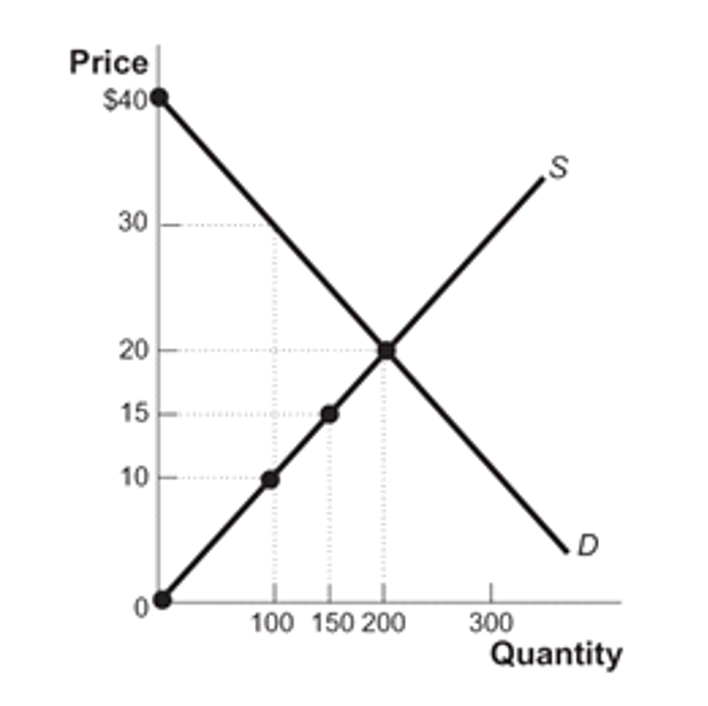

## Learning Objectives {.learning-objectives}

By the end of this chapter, you will be able to:

::: {.incremental}
- Calculate **consumer surplus** from willingness to pay
- Calculate **producer surplus** from willingness to sell
- Understand **total surplus** as a measure of market efficiency
- Analyze **deadweight loss** from price controls
- Identify sources of **market failure**
:::

---

## What is Consumer Surplus?

::: {.definition-box}
**Consumer Surplus (CS)** = Willingness to Pay - Price Paid

The difference between what consumers are willing to pay and what they actually pay
:::

. . .

**Example:** If you're willing to pay $50 for a concert ticket but only pay $30:

- Your consumer surplus = $50 - $30 = **$20**

---

## Individual Consumer Surplus: George Buys Shirts

```{r}
#| echo: false
#| fig-width: 10
#| fig-height: 6
#| fig-align: center

library(ggplot2)
library(tibble)

# Create data for George's demand
george_demand <- tibble(
  quantity = 0:4,
  wtp = c(18, 18, 14, 10, 6)
)

# Create the plot
ggplot() +
  # Draw demand bars
  geom_segment(data = george_demand[-1,],
               aes(x = quantity - 1, xend = quantity,
                   y = wtp, yend = wtp),
               linewidth = 1.5, color = "#2C5F8D") +
  geom_segment(data = george_demand[-1,],
               aes(x = quantity, xend = quantity,
                   y = wtp, yend = c(george_demand$wtp[-c(1,2)], 0)),
               linewidth = 1.5, color = "#2C5F8D") +
  # Price line at $10
  geom_hline(yintercept = 10, linewidth = 1.2,
             color = "#D55E00", linetype = "dashed") +
  annotate("text", x = 3.5, y = 10.8, label = "Price = $10",
           size = 6, color = "#D55E00", fontface = "bold") +
  # Shade consumer surplus
  geom_rect(aes(xmin = 0, xmax = 1, ymin = 10, ymax = 18),
            fill = "#56B4E9", alpha = 0.4) +
  geom_rect(aes(xmin = 1, xmax = 2, ymin = 10, ymax = 14),
            fill = "#56B4E9", alpha = 0.4) +
  # Labels
  annotate("text", x = 0.5, y = 14, label = "CS = $8",
           size = 5, fontface = "bold") +
  annotate("text", x = 1.5, y = 12, label = "CS = $4",
           size = 5, fontface = "bold") +
  annotate("text", x = 2.5, y = 8, label = "No CS\n(not purchased)",
           size = 4.5, color = "#888888") +
  # WTP annotations
  annotate("text", x = 0.5, y = 18.8, label = "WTP = $18",
           size = 4.5, color = "#2C5F8D") +
  annotate("text", x = 1.5, y = 14.8, label = "WTP = $14",
           size = 4.5, color = "#2C5F8D") +
  annotate("text", x = 2.5, y = 10.8, label = "WTP = $10",
           size = 4.5, color = "#2C5F8D") +
  scale_x_continuous(breaks = 0:4,
                     labels = c("0", "1st", "2nd", "3rd", "4th"),
                     limits = c(-0.2, 4)) +
  scale_y_continuous(breaks = seq(0, 20, 2),
                     limits = c(0, 20)) +
  labs(x = "Quantity of Shirts",
       y = "Price ($)",
       title = "George's Consumer Surplus at P = $10") +
  theme_minimal(base_size = 16) +
  theme(
    plot.title = element_text(hjust = 0.5, size = 20, face = "bold"),
    panel.grid.minor = element_blank(),
    axis.title = element_text(size = 18, face = "bold"),
    axis.text = element_text(size = 14)
  )
```

::: {.fragment}
**George buys 2 shirts at $10 each**

- 1st shirt: WTP = $18, CS = $18 - $10 = $8
- 2nd shirt: WTP = $14, CS = $14 - $10 = $4
- **Total CS = $8 + $4 = $12**
:::

---

## Market Consumer Surplus

```{r}
#| echo: false
#| fig-width: 10
#| fig-height: 6
#| fig-align: center

library(ggplot2)

# Create supply and demand data
price <- seq(0, 20, 0.1)
demand_q <- 100 - 4 * price
supply_q <- 2 * price

# Find equilibrium
eq_price <- 100 / 6
eq_quantity <- 2 * eq_price

# Create the plot
ggplot() +
  # Consumer surplus area
  geom_ribbon(data = data.frame(p = seq(eq_price, 25, 0.1)),
              aes(x = 100 - 4 * p, ymin = eq_price, ymax = p),
              fill = "#56B4E9", alpha = 0.5) +
  # Demand curve
  geom_line(aes(x = demand_q, y = price),
            linewidth = 1.5, color = "#2C5F8D") +
  # Supply curve
  geom_line(aes(x = supply_q, y = price),
            linewidth = 1.5, color = "#E69F00") +
  # Equilibrium price line
  geom_segment(aes(x = 0, xend = eq_quantity,
                   y = eq_price, yend = eq_price),
               linewidth = 1, linetype = "dashed", color = "#333333") +
  geom_segment(aes(x = eq_quantity, xend = eq_quantity,
                   y = 0, yend = eq_price),
               linewidth = 1, linetype = "dashed", color = "#333333") +
  # Equilibrium point
  geom_point(aes(x = eq_quantity, y = eq_price),
             size = 5, color = "#D55E00") +
  # Labels
  annotate("text", x = 85, y = 3, label = "Demand",
           size = 6, color = "#2C5F8D", fontface = "bold") +
  annotate("text", x = 85, y = 17, label = "Supply",
           size = 6, color = "#E69F00", fontface = "bold") +
  annotate("text", x = eq_quantity + 8, y = eq_price + 1.5,
           label = "E", size = 6, fontface = "bold") +
  annotate("text", x = 8, y = eq_price - 1,
           label = paste0("P* = $", round(eq_price, 2)),
           size = 5.5, fontface = "bold") +
  annotate("text", x = eq_quantity, y = -1.5,
           label = paste0("Q* = ", round(eq_quantity, 1)),
           size = 5.5, fontface = "bold") +
  annotate("text", x = 20, y = 20,
           label = "Consumer\nSurplus",
           size = 7, color = "#1E6BA8", fontface = "bold") +
  scale_x_continuous(limits = c(0, 100), expand = c(0, 0)) +
  scale_y_continuous(limits = c(0, 25), expand = c(0, 0),
                     labels = scales::dollar) +
  labs(x = "Quantity",
       y = "Price",
       title = "Consumer Surplus = Area Below Demand, Above Price") +
  theme_minimal(base_size = 16) +
  theme(
    plot.title = element_text(hjust = 0.5, size = 20, face = "bold"),
    panel.grid.minor = element_blank(),
    axis.title = element_text(size = 18, face = "bold"),
    axis.text = element_text(size = 14),
    panel.border = element_rect(fill = NA, linewidth = 1)
  )
```

::: {.fragment}
**Consumer Surplus** = Green shaded area

Sum of all individual CS for every unit purchased
:::

---

## What is Producer Surplus?

::: {.definition-box}
**Producer Surplus (PS)** = Price Received - Willingness to Sell

The difference between what producers receive and the minimum they would accept
:::

. . .

**Example:** If you're willing to sell a used textbook for $20 but receive $35:

- Your producer surplus = $35 - $20 = **$15**

---

## Individual Producer Surplus: Textbook Buyback

```{r}
#| echo: false
#| fig-width: 10
#| fig-height: 6
#| fig-align: center

library(ggplot2)
library(tibble)

# Create data for sellers
sellers <- tibble(
  seller = c("Aleisha", "Brad", "Chad", "Dee"),
  wts = c(5, 15, 25, 35),
  x_pos = 1:4
)

# Price = $25
price <- 25

ggplot(sellers, aes(x = x_pos, y = wts)) +
  # WTS bars
  geom_segment(aes(x = x_pos - 0.3, xend = x_pos + 0.3,
                   y = wts, yend = wts),
               linewidth = 2, color = "#E69F00") +
  geom_segment(aes(x = x_pos, xend = x_pos,
                   y = 0, yend = wts),
               linewidth = 2, color = "#E69F00") +
  # Price line
  geom_hline(yintercept = price, linewidth = 1.2,
             color = "#D55E00", linetype = "dashed") +
  annotate("text", x = 4.5, y = price + 2, label = "Price = $25",
           size = 6, color = "#D55E00", fontface = "bold", hjust = 0) +
  # Shade producer surplus
  geom_rect(aes(xmin = x_pos - 0.3, xmax = x_pos + 0.3,
                ymin = wts, ymax = price),
            data = sellers[sellers$wts <= price, ],
            fill = "#F0E442", alpha = 0.5) +
  # PS annotations
  annotate("text", x = 1, y = 15, label = "PS = $20",
           size = 5, fontface = "bold", color = "#CC5500") +
  annotate("text", x = 2, y = 20, label = "PS = $10",
           size = 5, fontface = "bold", color = "#CC5500") +
  annotate("text", x = 3, y = 12.5, label = "PS = $0",
           size = 5, fontface = "bold", color = "#CC5500") +
  annotate("text", x = 4, y = 18, label = "No Sale",
           size = 5, color = "#888888", fontface = "bold") +
  # WTS labels
  geom_text(aes(label = paste0("WTS = $", wts)),
            nudge_y = -3, size = 4.5, color = "#E69F00", fontface = "bold") +
  # Seller names
  scale_x_continuous(breaks = 1:4, labels = sellers$seller) +
  scale_y_continuous(limits = c(0, 45), breaks = seq(0, 40, 5),
                     labels = scales::dollar) +
  labs(x = "Seller",
       y = "Price ($)",
       title = "Producer Surplus: Who Sells at P = $25?") +
  theme_minimal(base_size = 16) +
  theme(
    plot.title = element_text(hjust = 0.5, size = 20, face = "bold"),
    panel.grid.minor = element_blank(),
    panel.grid.major.x = element_blank(),
    axis.title = element_text(size = 18, face = "bold"),
    axis.text = element_text(size = 14)
  )
```

::: {.fragment}
**At P = $25, three sellers participate:**

- Aleisha: PS = $25 - $5 = $20
- Brad: PS = $25 - $15 = $10
- Chad: PS = $25 - $25 = $0
- **Total PS = $30**
:::

---

## Market Producer Surplus

```{r}
#| echo: false
#| fig-width: 10
#| fig-height: 6
#| fig-align: center

library(ggplot2)

# Create supply and demand data
price <- seq(0, 20, 0.1)
demand_q <- 100 - 4 * price
supply_q <- 2 * price

# Find equilibrium
eq_price <- 100 / 6
eq_quantity <- 2 * eq_price

# Create the plot
ggplot() +
  # Producer surplus area
  geom_ribbon(data = data.frame(p = seq(0, eq_price, 0.1)),
              aes(x = 2 * p, ymin = p, ymax = eq_price),
              fill = "#F0E442", alpha = 0.6) +
  # Demand curve
  geom_line(aes(x = demand_q, y = price),
            linewidth = 1.5, color = "#2C5F8D") +
  # Supply curve
  geom_line(aes(x = supply_q, y = price),
            linewidth = 1.5, color = "#E69F00") +
  # Equilibrium price line
  geom_segment(aes(x = 0, xend = eq_quantity,
                   y = eq_price, yend = eq_price),
               linewidth = 1, linetype = "dashed", color = "#333333") +
  geom_segment(aes(x = eq_quantity, xend = eq_quantity,
                   y = 0, yend = eq_price),
               linewidth = 1, linetype = "dashed", color = "#333333") +
  # Equilibrium point
  geom_point(aes(x = eq_quantity, y = eq_price),
             size = 5, color = "#D55E00") +
  # Labels
  annotate("text", x = 85, y = 3, label = "Demand",
           size = 6, color = "#2C5F8D", fontface = "bold") +
  annotate("text", x = 85, y = 17, label = "Supply",
           size = 6, color = "#E69F00", fontface = "bold") +
  annotate("text", x = eq_quantity + 8, y = eq_price + 1.5,
           label = "E", size = 6, fontface = "bold") +
  annotate("text", x = 8, y = eq_price - 1,
           label = paste0("P* = $", round(eq_price, 2)),
           size = 5.5, fontface = "bold") +
  annotate("text", x = eq_quantity, y = -1.5,
           label = paste0("Q* = ", round(eq_quantity, 1)),
           size = 5.5, fontface = "bold") +
  annotate("text", x = 15, y = 10,
           label = "Producer\nSurplus",
           size = 7, color = "#CC8800", fontface = "bold") +
  scale_x_continuous(limits = c(0, 100), expand = c(0, 0)) +
  scale_y_continuous(limits = c(0, 25), expand = c(0, 0),
                     labels = scales::dollar) +
  labs(x = "Quantity",
       y = "Price",
       title = "Producer Surplus = Area Above Supply, Below Price") +
  theme_minimal(base_size = 16) +
  theme(
    plot.title = element_text(hjust = 0.5, size = 20, face = "bold"),
    panel.grid.minor = element_blank(),
    axis.title = element_text(size = 18, face = "bold"),
    axis.text = element_text(size = 14),
    panel.border = element_rect(fill = NA, linewidth = 1)
  )
```

::: {.fragment}
**Producer Surplus** = Yellow shaded area

Sum of all individual PS for every unit sold
:::

---

## Total Surplus: Measuring Market Efficiency

::: {.definition-box}
**Total Surplus (TS)** = Consumer Surplus + Producer Surplus

Measures the total net benefit from trade in a market
:::

```{r}
#| echo: false
#| fig-width: 10
#| fig-height: 6
#| fig-align: center

library(ggplot2)

# Create supply and demand data
price <- seq(0, 20, 0.1)
demand_q <- 100 - 4 * price
supply_q <- 2 * price

# Find equilibrium
eq_price <- 100 / 6
eq_quantity <- 2 * eq_price

# Create the plot
ggplot() +
  # Consumer surplus area
  geom_ribbon(data = data.frame(p = seq(eq_price, 25, 0.1)),
              aes(x = 100 - 4 * p, ymin = eq_price, ymax = p),
              fill = "#56B4E9", alpha = 0.5) +
  # Producer surplus area
  geom_ribbon(data = data.frame(p = seq(0, eq_price, 0.1)),
              aes(x = 2 * p, ymin = p, ymax = eq_price),
              fill = "#F0E442", alpha = 0.6) +
  # Demand curve
  geom_line(aes(x = demand_q, y = price),
            linewidth = 1.5, color = "#2C5F8D") +
  # Supply curve
  geom_line(aes(x = supply_q, y = price),
            linewidth = 1.5, color = "#E69F00") +
  # Equilibrium price line
  geom_segment(aes(x = 0, xend = eq_quantity,
                   y = eq_price, yend = eq_price),
               linewidth = 1, linetype = "dashed", color = "#333333") +
  geom_segment(aes(x = eq_quantity, xend = eq_quantity,
                   y = 0, yend = eq_price),
               linewidth = 1, linetype = "dashed", color = "#333333") +
  # Equilibrium point
  geom_point(aes(x = eq_quantity, y = eq_price),
             size = 5, color = "#D55E00") +
  # Labels
  annotate("text", x = 85, y = 3, label = "Demand",
           size = 6, color = "#2C5F8D", fontface = "bold") +
  annotate("text", x = 85, y = 17, label = "Supply",
           size = 6, color = "#E69F00", fontface = "bold") +
  annotate("text", x = eq_quantity + 8, y = eq_price + 1.5,
           label = "E", size = 6, fontface = "bold") +
  annotate("text", x = 20, y = 20,
           label = "CS",
           size = 8, color = "#1E6BA8", fontface = "bold") +
  annotate("text", x = 15, y = 10,
           label = "PS",
           size = 8, color = "#CC8800", fontface = "bold") +
  scale_x_continuous(limits = c(0, 100), expand = c(0, 0)) +
  scale_y_continuous(limits = c(0, 25), expand = c(0, 0),
                     labels = scales::dollar) +
  labs(x = "Quantity",
       y = "Price",
       title = "Total Surplus = CS + PS (Maximized at Equilibrium)") +
  theme_minimal(base_size = 16) +
  theme(
    plot.title = element_text(hjust = 0.5, size = 20, face = "bold"),
    panel.grid.minor = element_blank(),
    axis.title = element_text(size = 18, face = "bold"),
    axis.text = element_text(size = 14),
    panel.border = element_rect(fill = NA, linewidth = 1)
  )
```

---

## Knowledge Check: Market for Hamburgers

```{r}
#| echo: false
#| fig-width: 10
#| fig-height: 6
#| fig-align: center

# Create hamburger market
price_h <- seq(0, 10, 0.1)
demand_h <- 50 - 4 * price_h
supply_h <- 2 * price_h + 10

# Equilibrium
eq_price_h <- 40 / 6
eq_quantity_h <- 2 * eq_price_h + 10

ggplot() +
  # Demand curve
  geom_line(aes(x = demand_h, y = price_h),
            linewidth = 1.5, color = "#2C5F8D") +
  # Supply curve
  geom_line(aes(x = supply_h, y = price_h),
            linewidth = 1.5, color = "#E69F00") +
  # Equilibrium point
  geom_point(aes(x = eq_quantity_h, y = eq_price_h),
             size = 5, color = "#D55E00") +
  # Grid lines at equilibrium
  geom_segment(aes(x = 0, xend = eq_quantity_h,
                   y = eq_price_h, yend = eq_price_h),
               linewidth = 0.8, linetype = "dashed", color = "#666666") +
  geom_segment(aes(x = eq_quantity_h, xend = eq_quantity_h,
                   y = 0, yend = eq_price_h),
               linewidth = 0.8, linetype = "dashed", color = "#666666") +
  # Labels
  annotate("text", x = 45, y = 1, label = "Demand",
           size = 6, color = "#2C5F8D", fontface = "bold") +
  annotate("text", x = 45, y = 8.5, label = "Supply",
           size = 6, color = "#E69F00", fontface = "bold") +
  annotate("text", x = eq_quantity_h + 3, y = eq_price_h + 0.5,
           label = "E", size = 6, fontface = "bold") +
  scale_x_continuous(limits = c(0, 50), expand = c(0, 0),
                     breaks = seq(0, 50, 10)) +
  scale_y_continuous(limits = c(0, 10), expand = c(0, 0),
                     breaks = seq(0, 10, 1),
                     labels = scales::dollar) +
  labs(x = "Quantity of Hamburgers",
       y = "Price per Hamburger",
       title = "Market for Hamburgers") +
  theme_minimal(base_size = 16) +
  theme(
    plot.title = element_text(hjust = 0.5, size = 20, face = "bold"),
    panel.grid.minor = element_blank(),
    axis.title = element_text(size = 18, face = "bold"),
    axis.text = element_text(size = 14),
    panel.border = element_rect(fill = NA, linewidth = 1)
  )
```

::: {.fragment}
**Question:** At equilibrium, what is the consumer surplus?

**Answer:** Area of the triangle above P* and below demand curve

CS = ½ × base × height = ½ × 23.3 × (12.5 - 6.67) ≈ **$68**
:::

---

## Price Controls and Deadweight Loss

When government sets prices away from equilibrium:

::: {.columns}
::: {.column width="50%"}
**Price Ceiling** (below equilibrium)

- Creates shortage
- Reduces total surplus
- Creates deadweight loss
- Example: Rent control
:::

::: {.column width="50%"}
**Price Floor** (above equilibrium)

- Creates surplus
- Reduces total surplus
- Creates deadweight loss
- Example: Minimum wage
:::
:::

. . .

::: {.callout-important}
## Key Insight
Any price different from equilibrium reduces total surplus and creates **deadweight loss**
:::

---

## Deadweight Loss from Price Ceiling

```{r}
#| echo: false
#| fig-width: 10
#| fig-height: 6.5
#| fig-align: center

library(ggplot2)

# Market data
price <- seq(0, 20, 0.1)
demand_q <- 100 - 4 * price
supply_q <- 2 * price

# Equilibrium
eq_price <- 100 / 6
eq_quantity <- 2 * eq_price

# Price ceiling
ceiling_price <- 12
qd_ceiling <- 100 - 4 * ceiling_price
qs_ceiling <- 2 * ceiling_price

ggplot() +
  # Original total surplus (faded)
  geom_ribbon(data = data.frame(p = seq(ceiling_price, 25, 0.1)),
              aes(x = 100 - 4 * p, ymin = ceiling_price, ymax = p),
              fill = "#56B4E9", alpha = 0.2) +
  geom_ribbon(data = data.frame(p = seq(0, ceiling_price, 0.1)),
              aes(x = 2 * p, ymin = p, ymax = ceiling_price),
              fill = "#F0E442", alpha = 0.2) +
  # New CS after ceiling
  geom_ribbon(data = data.frame(p = seq(ceiling_price, 25, 0.1)),
              aes(x = pmin(100 - 4 * p, qs_ceiling), ymin = ceiling_price, ymax = p),
              fill = "#56B4E9", alpha = 0.6) +
  # New PS after ceiling
  geom_ribbon(data = data.frame(p = seq(0, ceiling_price, 0.1)),
              aes(x = pmin(2 * p, qs_ceiling), ymin = p, ymax = ceiling_price),
              fill = "#F0E442", alpha = 0.7) +
  # Deadweight loss triangle
  geom_polygon(aes(x = c(qs_ceiling, eq_quantity, qs_ceiling),
                   y = c(ceiling_price, eq_price,
                         (qs_ceiling - 0)/2)),
               fill = "#E74C3C", alpha = 0.6) +
  # Demand and supply curves
  geom_line(aes(x = demand_q, y = price),
            linewidth = 1.5, color = "#2C5F8D") +
  geom_line(aes(x = supply_q, y = price),
            linewidth = 1.5, color = "#E69F00") +
  # Price ceiling line
  geom_segment(aes(x = 0, xend = qd_ceiling,
                   y = ceiling_price, yend = ceiling_price),
               linewidth = 1.5, color = "#E74C3C", linetype = "solid") +
  # Equilibrium
  geom_point(aes(x = eq_quantity, y = eq_price),
             size = 5, color = "#888888", alpha = 0.5) +
  geom_segment(aes(x = eq_quantity, xend = eq_quantity,
                   y = 0, yend = eq_price),
               linewidth = 0.8, linetype = "dotted",
               color = "#888888", alpha = 0.5) +
  # Shortage arrows
  geom_segment(aes(x = qs_ceiling, xend = qs_ceiling,
                   y = 2, yend = 8),
               arrow = arrow(length = unit(0.3, "cm"), ends = "both"),
               linewidth = 1, color = "#333333") +
  # Labels
  annotate("text", x = 85, y = 3, label = "Demand",
           size = 6, color = "#2C5F8D", fontface = "bold") +
  annotate("text", x = 85, y = 17, label = "Supply",
           size = 6, color = "#E69F00", fontface = "bold") +
  annotate("text", x = 5, y = ceiling_price + 1.2,
           label = "Price Ceiling",
           size = 6, color = "#E74C3C", fontface = "bold") +
  annotate("text", x = 40, y = 14,
           label = "Deadweight\nLoss",
           size = 6.5, color = "#C0392B", fontface = "bold") +
  annotate("text", x = qs_ceiling - 8, y = 5,
           label = "Shortage",
           size = 5.5, fontface = "bold") +
  scale_x_continuous(limits = c(0, 100), expand = c(0, 0)) +
  scale_y_continuous(limits = c(0, 25), expand = c(0, 0),
                     labels = scales::dollar) +
  labs(x = "Quantity",
       y = "Price",
       title = "Price Ceiling Creates Deadweight Loss") +
  theme_minimal(base_size = 16) +
  theme(
    plot.title = element_text(hjust = 0.5, size = 20, face = "bold"),
    panel.grid.minor = element_blank(),
    axis.title = element_text(size = 18, face = "bold"),
    axis.text = element_text(size = 14),
    panel.border = element_rect(fill = NA, linewidth = 1)
  )
```

::: {.fragment}
- Quantity traded falls from Q* to Q~supplied~
- Creates **shortage** (Q~demanded~ > Q~supplied~)
- Red triangle = **Deadweight Loss** (lost total surplus)
:::

---

## Deadweight Loss from Price Floor

```{r}
#| echo: false
#| fig-width: 10
#| fig-height: 6.5
#| fig-align: center

library(ggplot2)

# Market data
price <- seq(0, 20, 0.1)
demand_q <- 100 - 4 * price
supply_q <- 2 * price

# Equilibrium
eq_price <- 100 / 6
eq_quantity <- 2 * eq_price

# Price floor
floor_price <- 18
qd_floor <- 100 - 4 * floor_price
qs_floor <- 2 * floor_price

ggplot() +
  # Original total surplus (faded)
  geom_ribbon(data = data.frame(p = seq(floor_price, 25, 0.1)),
              aes(x = 100 - 4 * p, ymin = floor_price, ymax = p),
              fill = "#56B4E9", alpha = 0.2) +
  geom_ribbon(data = data.frame(p = seq(0, floor_price, 0.1)),
              aes(x = 2 * p, ymin = p, ymax = floor_price),
              fill = "#F0E442", alpha = 0.2) +
  # New CS after floor
  geom_ribbon(data = data.frame(p = seq(floor_price, 25, 0.1)),
              aes(x = pmin(100 - 4 * p, qd_floor), ymin = floor_price, ymax = p),
              fill = "#56B4E9", alpha = 0.6) +
  # New PS after floor
  geom_ribbon(data = data.frame(p = seq(0, floor_price, 0.1)),
              aes(x = pmin(2 * p, qd_floor), ymin = p, ymax = floor_price),
              fill = "#F0E442", alpha = 0.7) +
  # Deadweight loss triangle
  geom_polygon(aes(x = c(qd_floor, eq_quantity, qd_floor),
                   y = c(floor_price, eq_price,
                         qd_floor/2)),
               fill = "#E74C3C", alpha = 0.6) +
  # Demand and supply curves
  geom_line(aes(x = demand_q, y = price),
            linewidth = 1.5, color = "#2C5F8D") +
  geom_line(aes(x = supply_q, y = price),
            linewidth = 1.5, color = "#E69F00") +
  # Price floor line
  geom_segment(aes(x = 0, xend = qs_floor,
                   y = floor_price, yend = floor_price),
               linewidth = 1.5, color = "#E74C3C", linetype = "solid") +
  # Equilibrium
  geom_point(aes(x = eq_quantity, y = eq_price),
             size = 5, color = "#888888", alpha = 0.5) +
  geom_segment(aes(x = eq_quantity, xend = eq_quantity,
                   y = 0, yend = eq_price),
               linewidth = 0.8, linetype = "dotted",
               color = "#888888", alpha = 0.5) +
  # Surplus arrows
  geom_segment(aes(x = qd_floor, xend = qd_floor,
                   y = 10, yend = 16),
               arrow = arrow(length = unit(0.3, "cm"), ends = "both"),
               linewidth = 1, color = "#333333") +
  # Labels
  annotate("text", x = 85, y = 3, label = "Demand",
           size = 6, color = "#2C5F8D", fontface = "bold") +
  annotate("text", x = 85, y = 17, label = "Supply",
           size = 6, color = "#E69F00", fontface = "bold") +
  annotate("text", x = 5, y = floor_price - 1.2,
           label = "Price Floor",
           size = 6, color = "#E74C3C", fontface = "bold") +
  annotate("text", x = 45, y = 15,
           label = "Deadweight\nLoss",
           size = 6.5, color = "#C0392B", fontface = "bold") +
  annotate("text", x = qd_floor - 8, y = 13,
           label = "Surplus",
           size = 5.5, fontface = "bold") +
  scale_x_continuous(limits = c(0, 100), expand = c(0, 0)) +
  scale_y_continuous(limits = c(0, 25), expand = c(0, 0),
                     labels = scales::dollar) +
  labs(x = "Quantity",
       y = "Price",
       title = "Price Floor Creates Deadweight Loss") +
  theme_minimal(base_size = 16) +
  theme(
    plot.title = element_text(hjust = 0.5, size = 20, face = "bold"),
    panel.grid.minor = element_blank(),
    axis.title = element_text(size = 18, face = "bold"),
    axis.text = element_text(size = 14),
    panel.border = element_rect(fill = NA, linewidth = 1)
  )
```

::: {.fragment}
- Quantity traded falls from Q* to Q~demanded~
- Creates **surplus** (Q~supplied~ > Q~demanded~)
- Red triangle = **Deadweight Loss** (lost total surplus)
:::

---

## When is a Market Efficient?

::: {.callout-note icon=false}
## Three Conditions for Market Efficiency

1. **Allocative Efficiency**: Goods go to buyers who value them most (highest WTP)

2. **Productive Efficiency**: Goods produced by sellers with lowest costs (lowest WTS)

3. **Equilibrium**: Supply equals demand (P* where S = D)
:::

. . .

::: {.fragment}
**At equilibrium:**

- Total surplus is **maximized**
- No deadweight loss
- All mutually beneficial trades occur
:::

---

## Market Failures

When do markets **fail** to maximize total surplus?

::: {.incremental}
1. **Lack of Competition**
   - Monopoly power
   - Firms can restrict output, raise prices

2. **Information Asymmetry**
   - One party has more information
   - Example: Used car market (lemons problem)

3. **Externalities**
   - Costs or benefits affect third parties
   - Example: Pollution, education

4. **Public Goods**
   - Non-excludable, non-rivalrous
   - Example: National defense, lighthouses
:::

---

## Real World Application: Uber Surge Pricing

**Dynamic Pricing = Market Equilibrium in Action**

::: {.columns}
::: {.column width="50%"}
**Normal Times:**
- P = $10
- Supply = Demand
- No surge
:::

::: {.column width="50%"}
**High Demand Times:**
- Demand increases
- Shortage at P = $10
- Surge pricing (P = $25)
- More drivers enter
- Market clears
:::
:::

. . .

::: {.fragment}
**Why does Uber do this?**

- Eliminates shortages
- Increases total surplus
- Attracts more drivers when needed
- Allocates rides to those who value them most
:::

---

## Knowledge Check: Octopus Candle Holder

{fig-align="center" width="40%"}

**You bought this for $15 at a thrift store. You see it's selling on eBay for $60.**

::: {.fragment}
**What is your consumer surplus?**

**Answer:** CS = WTP - Price = $60 - $15 = **$45**

You would have been willing to pay up to $60 (its market value), but only paid $15!
:::

---

## Knowledge Check: George Buys Shirts (Part 1)

**George wants to buy shirts for work. His willingness to pay:**
- 1st shirt: $35
- 2nd shirt: $25
- 3rd shirt: $15

**Price at Oxford & Co: $28 each**

{fig-align="center" width="30%"}

::: {.fragment}
**What is the efficient number of shirts for George to buy?**

a) 0
b) 1
c) 2
d) 3
:::

::: {.fragment}
**Answer: b) 1 shirt**

Only the 1st shirt has WTP ($35) > Price ($28)
:::

---

## Knowledge Check: George Buys Shirts (Part 2)

**George buys 1 shirt at $28**

{fig-align="center" width="40%"}

::: {.fragment}
**What is George's consumer surplus?**

a) $0
b) $7
c) $10
d) $28
e) $35
:::

::: {.fragment}
**Answer: b) $7**

CS = WTP - Price = $35 - $28 = **$7**
:::

---

## Knowledge Check: Calculators

**Mark and Rasheed are buying graphing calculators for Math 19.**

- Mark's WTP = $75
- Rasheed's WTP = $100
- Bookstore price = $65

::: {.fragment}
**What is their total consumer surplus?**

a) $10
b) $35
c) $45
d) $60
:::

::: {.fragment}
**Answer: c) $45**

- Mark's CS: $75 - $65 = $10
- Rasheed's CS: $100 - $65 = $35
- **Total CS = $10 + $35 = $45**
:::

---

## Knowledge Check: Textbook Buyback

**Four students selling textbooks to the bookstore at P = $25**

| Seller | Willingness to Sell |
|--------|-------------------|
| Aleisha | $5 |
| Brad | $15 |
| Daya | $22 |
| Red | $30 |

::: {.fragment}
**How many students will sell their textbooks?**

a) 0  b) 1  c) 2  d) 3  e) 4
:::

::: {.fragment}
**Answer: d) 3 students**

Aleisha, Brad, and Daya all have WTS ≤ $25

Red's WTS ($30) > Price, so Red won't sell
:::

---

## Real World: Uber Surge Pricing

::: {.callout-note icon=false}
## The Scenario

*"The sky is dumping freezing rain, it's 11:30 at night, and you're standing on a street corner 15 miles from home. You open your Uber app and see that the trip is going to cost you roughly $50, as prices are surging 200 percent above normal. But you summon the car anyways. In fact, you might not have hesitated to go as high as $100, just to get dry in that comprising moment."*

— Laura Bliss, Bloomberg, September 15, 2016
:::

::: {.fragment}
**What is your consumer surplus?**

**Answer:** CS = WTP - Price = $100 - $50 = **$50**
:::

---

## Discussion: What Market Problem Does Uber Solve?

**Traditional taxi system:**
- Fixed prices (meter rates)
- Limited supply
- During high demand → **shortages** (can't find a cab!)

. . .

**Uber's dynamic pricing:**
- Prices rise when demand increases
- Higher prices attract more drivers
- Market clears → **no shortage**
- Allocates rides to those who value them most

. . .

::: {.callout-tip}
## Economic Insight
Surge pricing eliminates deadweight loss by allowing the market to reach equilibrium, even during demand spikes
:::

---

## Uber: An Economist's Dream

**Why economists love Uber's data:**

::: {.incremental}
1. **Real-time pricing experiments** - See how consumers respond to different prices
2. **Massive dataset** - Millions of transactions per day
3. **Revealed preferences** - Actions show true willingness to pay
4. **Natural experiments** - Weather, events, time of day create variation
5. **Elasticity estimation** - Measure price sensitivity precisely
:::

. . .

**Consumer surplus estimate:** Americans would pay an extra **$7 billion** for Uber beyond what they actually pay!

---

## Knowledge Check: Octopus Candle Holders (Part 1)

{fig-align="center" width="25%"}

**Market for octopus candle holders:**
- Equilibrium: P = $20, Q = 200
- Demand intercept: $40
- Supply intercept: $0

::: {.fragment}
**What is producer surplus at equilibrium?**

a) $1,000
b) $2,000
c) $4,000
d) $8,000
:::

::: {.fragment}
**Answer: b) $2,000**

PS = ½ × base × height = ½ × 200 × ($20 - $0) = **$2,000**
:::

---

## Knowledge Check: Octopus Candle Holders (Part 2)

{fig-align="center" width="25%"}

::: {.fragment}
**What is total surplus at equilibrium?**

a) $1,000
b) $2,000
c) $4,000
d) $8,000
:::

::: {.fragment}
**Answer: c) $4,000**

- CS = ½ × 200 × ($40 - $20) = $2,000
- PS = ½ × 200 × ($20 - $0) = $2,000
- **TS = $2,000 + $2,000 = $4,000**
:::

---

## Knowledge Check: Octopus Candle Holders (Part 3)

{fig-align="center" width="25%"}

**Amazon imposes a price ceiling at $15**

::: {.fragment}
**What is the new producer surplus?**

a) $1,125
b) $1,875
c) $2,000
d) $2,250
:::

::: {.fragment}
**Answer: a) $1,125**

At P = $15: Q_supplied = 150

PS = ½ × 150 × ($15 - $0) = **$1,125**

(Note: Price ceiling reduces PS and creates deadweight loss!)
:::

---

## Why Markets Work Well

::: {.definition-box}
**Property Rights**: The rights of owners to use, sell, or benefit from their property as they choose
:::

::: {.definition-box}
**Economic Signals**: Information (like prices) that helps people make better economic decisions
:::

. . .

**When property rights are clear and prices signal scarcity:**

::: {.incremental}
- Resources flow to highest-value uses
- Producers have incentive to minimize costs
- Innovation is rewarded
- Waste is minimized
:::

---

## Market Failures in Detail

### 1. Lack of Competition

**Monopoly power** allows firms to:
- Restrict output below efficient level
- Charge prices above marginal cost
- Reduce total surplus

. . .

### 2. Information Asymmetry

**When one party knows more:**
- Used car market ("lemons problem")
- Insurance markets (adverse selection)
- Healthcare services
- Can cause markets to collapse entirely

---

## Market Failures (Continued)

### 3. Externalities

**External costs or benefits not reflected in price:**

::: {.columns}
::: {.column width="50%"}
**Negative Externalities**
- Pollution
- Traffic congestion
- Secondhand smoke
- Noise

→ Overproduction
:::

::: {.column width="50%"}
**Positive Externalities**
- Education
- Vaccination
- R&D
- Beautiful gardens

→ Underproduction
:::
:::

---

## Market Failures (Continued)

### 4. Public Goods

::: {.definition-box}
**Public Goods** are:
- **Non-excludable**: Can't prevent non-payers from consuming
- **Non-rivalrous**: One person's consumption doesn't reduce availability to others
:::

. . .

**Examples:**
- National defense
- Lighthouses
- Public parks
- Clean air
- Basic research

. . .

**Problem:** Free-rider incentive → private markets underprovide → government role

---

## Summary: Key Takeaways

::: {.summary-box}
**Consumer Surplus** = WTP - Price (area below demand, above price)

**Producer Surplus** = Price - WTS (area above supply, below price)

**Total Surplus** = CS + PS (maximized at equilibrium)

**Deadweight Loss** = Lost surplus from prices away from equilibrium

**Market Efficiency** requires:
- Competition
- Complete information
- No externalities
- Private goods
:::

---

## Next Chapter Preview

**Chapter 5: Elasticity**

- How responsive are buyers and sellers to price changes?
- Price elasticity of demand and supply
- Applications to tax incidence and revenue

::: {.callout-tip}
## Coming Up
We'll learn why a tax on luxury yachts hurts workers more than yacht buyers!
:::
